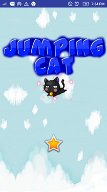
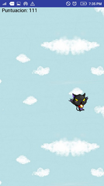
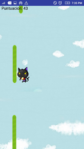
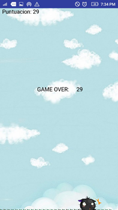

# Juego JumpingCat  -  InformeFinal

## Curso 📦
* DESARROLLO DE APLICACIONES MÓBILES

## Docente 📄
* LOZANO CHU, Ali

_Es un juego desarrollado en Android Studio, con la finalidad de subir la notita del ToDo que no es copia 🚀_

## Alumnos 🖇️
* FLORES HORNA, Renzo Aarón
* PALACIOS CASTILLO, Jesús Rafael
* LETURIA RODRIGUEZ, Walter Ivan

## PROBLEMAS ENCONTRADOS EN EL DESARROLLO 🔧
* Generar estado de pared cuando toca el borde arriba o debajo de un bloque pared.
*	Encontrar el estado tocas bloque cuando el movimiento en X se realiza sumando una cantidad fija.
*	Finalizar el sonido de los fondos cuando se cambia entre Ventanas.

## HISTORIAS DE USUARIO

|Historia de usuario| |
| ----- | ---- |
|Numero:  1	|suario: Cliente|
|Nombre historia: Preparar Sprites||
|Prioridad en negocio:Baja	|Riesgo en desarrollo:Baja|
|Puntos estimados:4|	Iteración asignada:1|
|Programador responsable: Palacios Castillo, Jesús||
|Descripción: Debe tener personajes, bloques,  fondos y sonidos divertidos para el usuario||

|Historia de usuario||
| ----- | ---- |
|Numero:  2	|Usuario: Cliente|
|Nombre historia: Dibujar fondo infinito||
|Prioridad en negocio:Baja	|Riesgo en desarrollo:Baja|
|Puntos estimados:2|Iteración asignada:1|
|Programador responsable: Leturia Rodriguez, Walter||
|Descripción: Debe permitir ver un fondo a donde sea q se mueva el personaje||

|Historia de usuario||
| ----- | ---- |
|Numero:  3	|Usuario: Cliente|
|Nombre historia: Generar Camino infinito ||
|Prioridad en negocio:Media	|Riesgo en desarrollo:Media|
|Puntos estimados:6	|Iteración asignada:1|
|Programador responsable: Flores Horna, Renzo Aarón|
|Descripción: Debe permitir seguir saltando por un camino interminable que tenga una corta distancia entre los bloques||

|Historia de usuario||
| ----- | ---- |
|Numero:  4	|Usuario: Cliente|
|Nombre historia: Crear bloques donde salte||
|Prioridad en negocio:Alta	|Riesgo en desarrollo:Alta|
|Puntos estimados:8	|Iteración asignada:2|
|Programador responsable: Flores Horna, Renzo Aarón||
|Descripción: Debe permitir al personaje sostenerse de bloques en el aire para continuar saltando||

|Historia de usuario||
| ----- | ---- |
|Numero:  5	|Usuario: Cliente|
|Nombre historia: Saltar con realidad||
|Prioridad en negocio:Alta	|Riesgo en desarrollo:Alta|
|Puntos estimados:10	|Iteración asignada:1|
|Programador responsable: Flores Horna, Renzo Aarón||
|Descripción: Debe de saltar el personaje con gravedad haciendo que caiga más rápido. Solo debe poder saltar 2 veces antes de tocas bloque||

|Historia de usuario||
| ----- | ---- |
|Numero:  6|	Usuario: Cliente|
|Nombre historia: Puntuación Máxima||
|Prioridad en negocio:Baja	|Riesgo en desarrollo:Baja|
|Puntos estimados:2|	Iteración asignada:3|
|Programador responsable: Palacios Castillo, Jesús|
|Descripción: Debe permitir obtener la puntuación máxima del juego en base a la altura máxima alcanzada|

|Historia de usuario||
| ----- | ---- |
|Numero:  7	|Usuario: Cliente|
|Nombre historia: Preparar Sprites||
|Prioridad en negocio:Baja	|Riesgo en desarrollo:Baja|
|Puntos estimados:4	|Iteración asignada:1|
|Programador responsable: Flores Horna, Renzo Aarón||
|Descripción: Debe tener imágenes del juego atractivas para los que juegan||

## SCREENSHOTS DEL PROYECTO FINAL
* PAGINA PRINCIPAL

* GATO SALTANDO

* BLOQUE PEGADO

* GAMEOVER

## CUADRO DE RESUMEN DE HISTORIAS DE USUARIO
|HISTORIAS	                   |   PUNTOS	   |   PRIORIDADES  |   TERMINADA |
| ----- | ---- | ---- | ---- |
|Preparar sprites	           |     4       |      	1       |      SI |
|Dibujar fondo infinito	     |     2       |       	2       |      SI |
|Generar camino infinito	     |     6       |      	3       |      SI |
|Crear bloques donde salte	   |     8       |      	4       |      SI |
|Saltar con realidad	         |     10      |      	4       |      SI |
|Puntuación máxima	           |     2       |      	3       |      SI |
|Generar algoritmo game over	 |     4       |       	3       |      SI |
